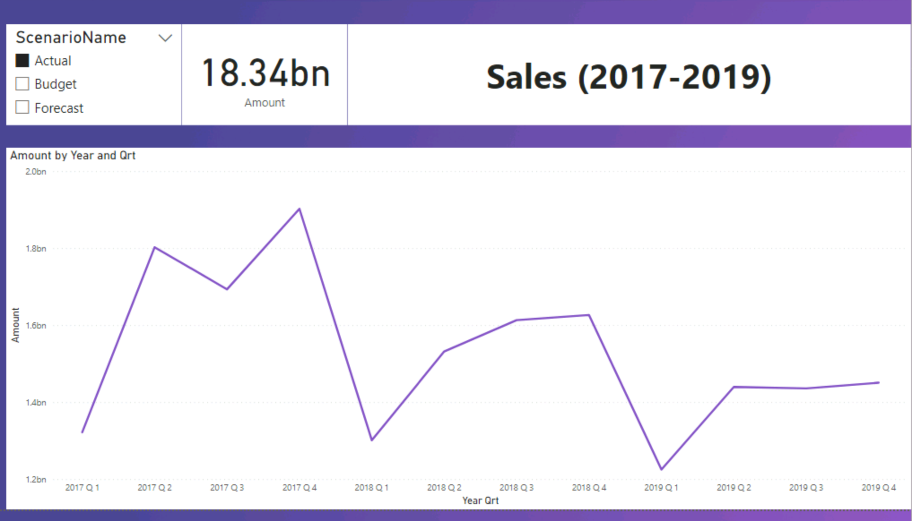
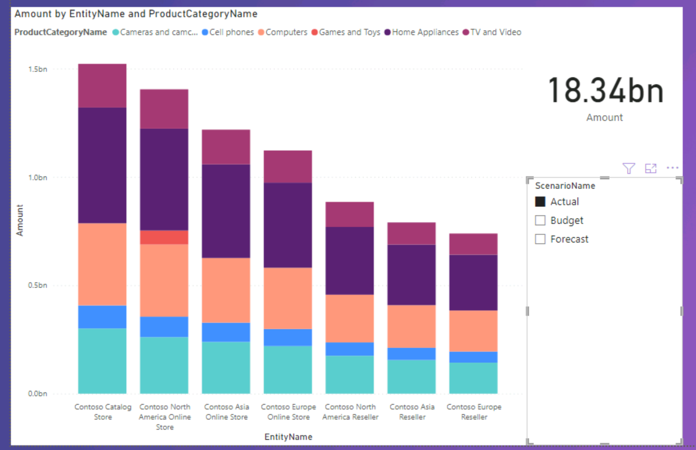
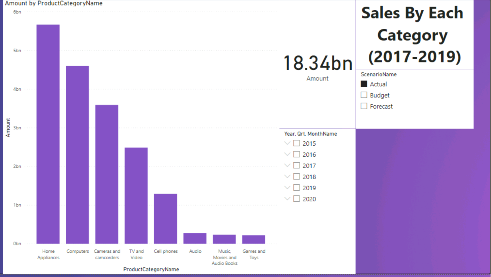
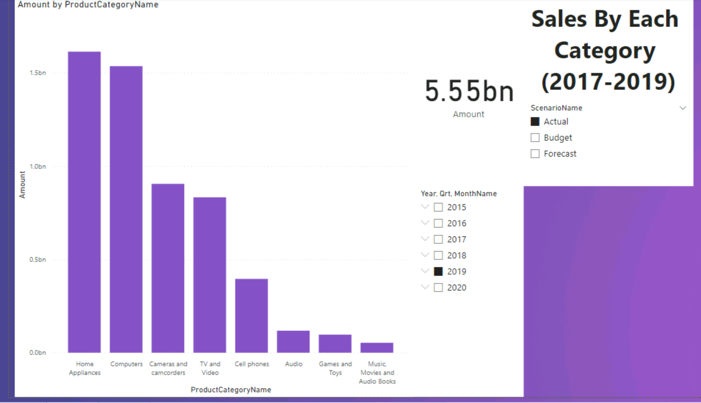

# Sales-Scenario-Analysis
Used Power BI to plot the actual and projected sales of a company over time

## Overview

This project visualizes sales data from a fictional company, Contoso. The dataset was provided by DataCamp in their "Introduction to Power BI" course. Sales data is split into 3 categories: actual, budget, and forecast. The sales data was filtered based on this dimension, with a focus on the sales from the "actual" category. 

## Results

### Model

Below is a diagram showing the relationships between data tables. 

### Line Plot

In the line plot below, it is evident from the area under the plot that sales are decreasing each year from 2017-2019. This is an important issue that should be further analyzed by the company. Moreover, sales are lowest in the first quarter of each year. In contrast, the fourth quarter shows the best performance, which could be due to Christmas season.

### Bar Plots

The bar chart below shows the distribution of sales across all stores. The plot shows that Contoso Catalog Store has accrued the most sales. In addition, the plot shows that Contoso North American Online Store is the only store selling games and toys.

It is evident from the bar plot below that home appliances and computers have the most sales.

Using the slicer to the right, we can filter by the year. The distribution of 2019 sales is very similar to that for all years. 

